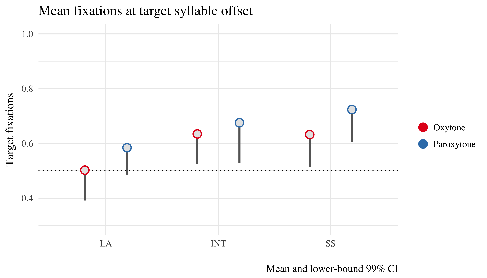
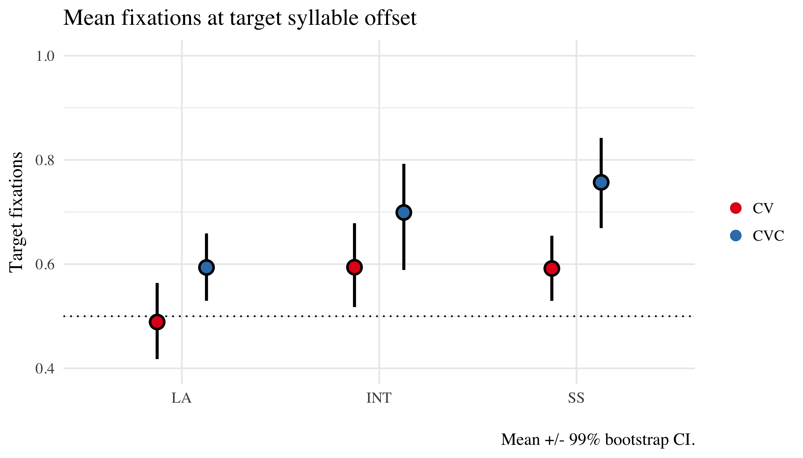
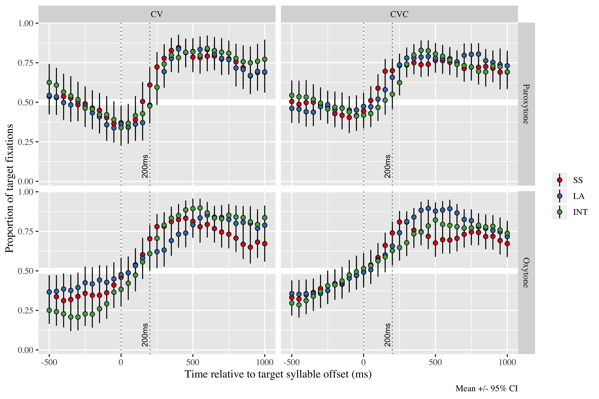
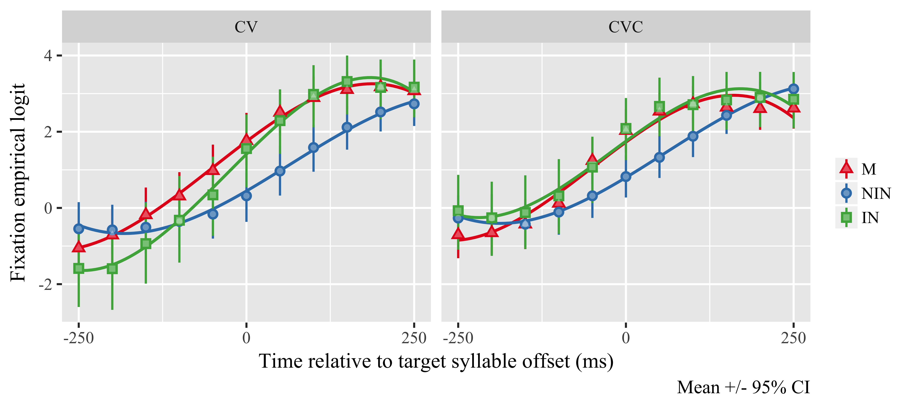

# t-tests

```{r, echo=FALSE}
stress_ttest <- readRDS("./mods/stress_ttest.rds")
```

- To answer the question of whether or not groups could predict the word before the target syllable onset
- We used single sided t-tests to compare each group in each condition against chance. 
- NATIVE SPEAKER and INTERPRETERS fixate on targets above chance at the target syllable offset
For both oxytone and paroxytone conditions (this is at bonforroni corrected alpha = 0.008)


```{r, results='asis', echo=FALSE}
print(xtable::xtable(stress_ttest[, c(1:7, 11)]), type = 'latex')
```



\clearpage

# glmem

- random intercept for subject/items, random slope for stress, WM added as covariate
- MAIN EFFECT OF GROUP:
	- NATIVES and INT fixate on targets at syllable offset significantly more than LA
- MAIN EFFECT OF CODA:
	- CVC syllables receive more target fixations at syllable offset than CV syllables
- NO MAIN EFFECT OF STRESS (cond: X2(1) = 0.62, p > 0.05) NOR WM (X2(1) = 1.16, p > 0.05)
- NO SIG. INTERACTIONS

## Model comparisons

|       Model       |  AIC   |  BIC   |  logLik | deviance | Chisq  | Chi Df |   Pr(>Chisq)  |
| :---------------- | :----- | :----- | :------ | :------- | :----- | :----- | :------------ |
| group             | 8419.2 | 8490.6 | -4194.6 | 8389.2   | 11.273 | 2      | 0.003565  *** |
| cond              | 8420.6 | 8496.8 | -4194.3 | 8388.6   | 0.6178 | 1      | 0.4319        |
| coda              | 8413.5 | 8489.7 | -4190.7 | 8381.5   | 7.7467 | 1      | 0.005381  **  |
| wm                | 8413.6 | 8489.8 | -4190.3 | 8380.8   | 1.2563 | 1      | 0.4316        |
| group x coda      | 8415.3 | 8501.0 | -4189.7 | 8379.3   | 2.1485 | 2      | 0.3416        |
| group x condition | 8412.6 | 8503.1 | -4187.3 | 8374.6   | 6.897  | 3      | 0.07525       |
| cond x coda       | 8412.2 | 8497.9 | -4188.1 | 8376.2   | 5.2914 | 2      | 0.07096       |
| full              | 8420.5 | 8534.8 | -4186.3 | 8372.5   | 8.9397 | 8      | 0.3474        |

## Final mod

|  Term       | Estimate | Std. Error | z value | Pr(>\|z\|)   |
| :-          | :-       | :-         | :-      | :-           |
| (Intercept) | 1.6025   | 0.2886     | 5.553   | 2.81e-08 *** |
| groupla     | -1.1382  | 0.3274     | -3.476  | 0.000509 *** |
| groupint    | -0.4926  | 0.4270     | -1.153  | 0.248711     |
| codaSum1    | -0.8177  | 0.2258     | -3.621  | 0.000294 *** |

Relevel w/ int as baseline

|             | Estimate | Std. Error | z value |    Pr(>\|z\|) |
| :---------- | :------- | :--------- | :------ | :---------    |
| (Intercept) | 1.0620   | 0.3840     | 2.765   | 0.00568 **    |
| groupla     | -0.6426  | 0.4049     | -1.587  | 0.11249       |
| groupss     | 0.4879   | 0.4244     | 1.150   | 0.25028       |
| codaSum1    | -0.6111  | 0.2170     | -2.816  | 0.00486 **    |




\clearpage

# GCA

- Time course analyzed using GCA
- We fit 3rd order orthogonal polynomials to the data as the functional form
- No significant effects of cubic time terms
- No effects of STRESS (X2(1) = 3.39, p > 0.05)
- Sig. effect of quadratic time term on LA 
	- overall, their time course is less bowed than the NS = slower fixation rate
- Group x coda interactions for INT and LA
	- LA fixate on targets earlier (before offset of target syllable) if there is a coda, without coda they do not anticipate
	- INT fixate at faster rate than natives, but later in time course (equal to natives by target offset)
- INT didnt differ from natives in CVC condition


|                       | Estimate | Std. Error |    df   | t value |   Pr(>\|t\|) |
| :-------------------- | -------: | ---------: | ------: | ------: | :----------- |
| (Intercept)           |  0.89485 |    0.14747 |   68.00 |   6.068 | 6.41e-08 *** |
| ot1                   |  3.33309 |    0.37630 |   67.00 |   8.858 | 7.25e-13 *** |
| ot2                   | -0.16281 |    0.23645 |   55.00 |  -0.689 | 0.49401      |
|                       |          |            |         |         |              |
| groupla               | -0.37843 |    0.19871 |   68.00 |  -1.904 | 0.06107 .    |
| ot1:groupla           | -0.84030 |    0.50822 |   67.00 |  -1.653 | 0.10291      |
| ot2:groupla           |  1.04784 |    0.31978 |   55.00 |   3.277 | 0.00182 **   |
|                       |          |            |         |         |              |
| groupint              | -0.11347 |    0.26369 |   68.00 |  -0.430 | 0.66832      |
| ot1:groupint          |  0.07456 |    0.67747 |   69.00 |   0.110 | 0.91268      |
| ot2:groupint          | -0.18355 |    0.42840 |   59.00 |  -0.428 | 0.66989      |
|                       |          |            |         |         |              |
| codaSum1              |  0.07384 |    0.05076 | 9377.00 |   1.455 | 0.14578      |
| ot1:codaSum1          |  0.25070 |    0.17745 | 8565.00 |   1.413 | 0.15777      |
| ot2:codaSum1          |  0.05033 |    0.17117 | 6255.00 |   0.294 | 0.76874      |
|                       |          |            |         |         |              |
| groupla:codaSum1      | -0.17708 |    0.06821 | 9430.00 |  -2.596 | 0.00945 **   |
| ot1:groupla:codaSum1  | -0.33634 |    0.23883 | 8657.00 |  -1.408 | 0.15909      |
| ot2:groupla:codaSum1  |  0.09856 |    0.23274 | 6338.00 |   0.423 | 0.67196      |
|                       |          |            |         |         |              |
| groupint:codaSum1     | -0.29203 |    0.09172 | 9378.00 |  -3.184 | 0.00146 **   |
| ot1:groupint:codaSum1 |  0.32001 |    0.32918 | 8746.00 |   0.972 | 0.33102      |
| ot2:groupint:codaSum1 |  0.07729 |    0.31381 | 7054.00 |   0.246 | 0.80545      |





